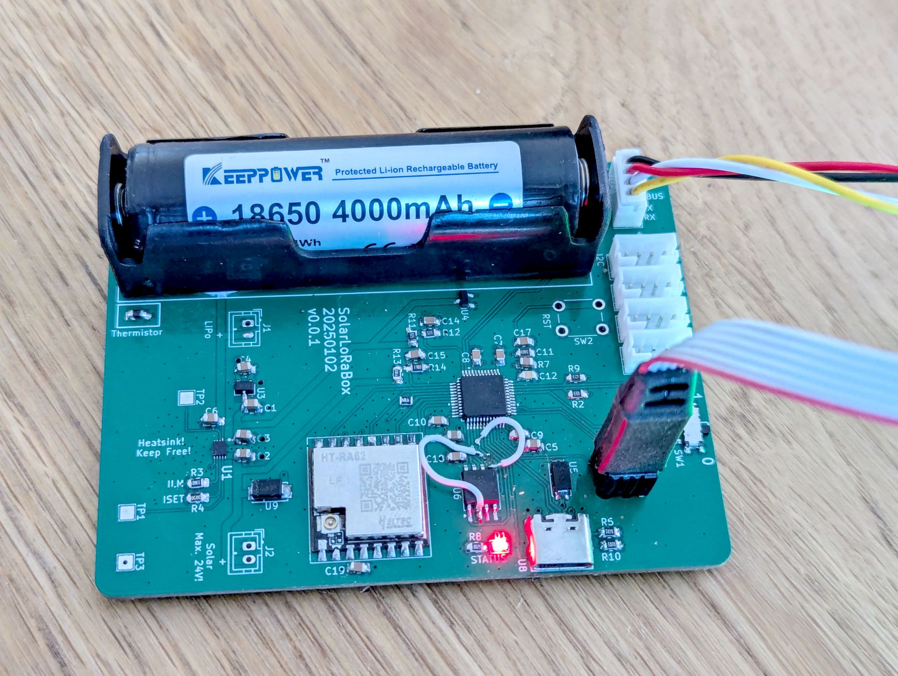

# Hardware verification (v0.0.1)



### SWD interface: ✅

```
 - Connecting via USB to probe/ programmer device 0
 - Probe/ Programmer firmware: x
 - Probe/ Programmer S/N: x
 - Device "STM32U083CC" selected.
 - Target interface speed: 4000 kHz (Fixed)
 - VTarget = 3.324V
 - InitTarget() start
 - InitTarget() end - Took 33.1ms
 - Found SW-DP with ID 0x6BA02477
 - DPIDR: 0x6BA02477
 - CoreSight SoC-400 or earlier
 - Scanning AP map to find all available APs
 - AP[2]: Stopped AP scan as end of AP map has been reached
 - AP[0]: AHB-AP (IDR: 0x84770001, ADDR: 0x00000000)
 - AP[1]: APB-AP (IDR: 0x54770002, ADDR: 0x01000000)
 - Iterating through AP map to find AHB-AP to use
 - AP[0]: Core found
 - AP[0]: AHB-AP ROM base: 0xF0000000
 - CPUID register: 0x410CC601. Implementer code: 0x41 (ARM)
 - Found Cortex-M0 r0p1, Little endian.
 - FPUnit: 4 code (BP) slots and 0 literal slots
 - CoreSight components:
 - ROMTbl[0] @ F0000000
 - [0][0]: E00FF000 CID B105100D PID 000BB4C0 ROM Table
 - ROMTbl[1] @ E00FF000
 - [1][0]: E000E000 CID B105E00D PID 000BB008 SCS
 - [1][1]: E0001000 CID B105E00D PID 000BB00A DWT
 - [1][2]: E0002000 CID B105E00D PID 000BB00B FPB
 - Executing init sequence ...
  - Initialized successfully
 - Target interface speed: 4000 kHz (Fixed)
 - Found 1 JTAG device. Core ID: 0x6BA02477 (None)
 - Connected successfully
```

### Bootloader mode (USB): ✅

Switch set to "0"

```
Found DFU: [0483:df11] ver=0220, devnum=13, cfg=1, intf=0, path="3-3.3", alt=3, name="@ENGI Bytes        /0x1FFF6C00/01*1024.e", serial="x"
Found DFU: [0483:df11] ver=0220, devnum=13, cfg=1, intf=0, path="3-3.3", alt=2, name="@OTP Memory        /0x1FFF6800/01*1024 e", serial="x"
Found DFU: [0483:df11] ver=0220, devnum=13, cfg=1, intf=0, path="3-3.3", alt=1, name="@OB Bytes          /0x40022020/01*136 e", serial="x"
Found DFU: [0483:df11] ver=0220, devnum=13, cfg=1, intf=0, path="3-3.3", alt=0, name="@Internal Flash    /0x08000000/128*02Kg", serial="x"
```

### USB: ⚠️

That USB-C connector is useless in a box.

Replace with a JST connector as 12MBit/s USB isn't critical in terms of impedance matching. 

### LED: ✅

Blinks.

### UART: ⚠️

Mixed up Silk print. RX/TX text must be swapped.

### SPI, Flash: 🚨

MOSI -> DI

MISO -> DO

Whoever did this..  that's not the usual convention how you name things on a SPI bus.

If switched it works.

```
/* 0x90 = Read Device ID
 * 0x00 0x00 0x00 = Dummy Address
*/
uint8_t request[4] = { 0x90, 0x00, 0x00, 0x00 };

uint8_t response[2] = { 0 };

HAL_GPIO_WritePin(GPIOA, FLASH_CS_Pin, GPIO_PIN_RESET);
HAL_SPI_Transmit(&hspi2, request, sizeof(request), HAL_MAX_DELAY);
HAL_SPI_Receive(&hspi2, response, sizeof(response), HAL_MAX_DELAY);
HAL_GPIO_WritePin(GPIOA, FLASH_CS_Pin, GPIO_PIN_SET);
```

Results in

```
response[0]	uint8_t	0xef (Hex)	
response[1]	uint8_t	0x17 (Hex)	
```

Which is the same specified in the datasheet.

### SPI, LoRa: ✅

```
	/* 0x1d = Read one or several registers
	 * 0x0320 = Product ID String
	 */
	uint8_t request[4] = { 0x1D, 0x03, 0x20 };
	uint8_t response[16] = { 0 };

	/* Infinite loop */
	for (;;) {
		osDelay(1000);

		HAL_GPIO_WritePin(GPIOA, RADIO_CS_Pin, GPIO_PIN_RESET);

		HAL_SPI_Transmit(&hspi1, request, sizeof(request), HAL_MAX_DELAY);
		HAL_SPI_Receive(&hspi1, response, sizeof(response), HAL_MAX_DELAY);

		HAL_GPIO_WritePin(GPIOA, RADIO_CS_Pin, GPIO_PIN_SET);

		printf("LoRa Product ID: %s\r\n", response);

	}


```

Results in

```
LoRa Product ID: SX1261 V2D 2D02
```

### ADC: ✅

```
Channel 6 Input Voltage: 4.699 V
Channel 7 Input Voltage: 1.368 V
```

### Reset IC: ⚠️

Needs a buffer capacitor in front of  the sensing line. 

[This caused problems with the SolarMeshtasticBox.](https://github.com/dm5tt/SolarMeshtasticNode/issues/3)

### Run Test ✅


No power saving implemented - just a naked Zephyr that pushes the battery voltage to the TheThingsNetwork.

