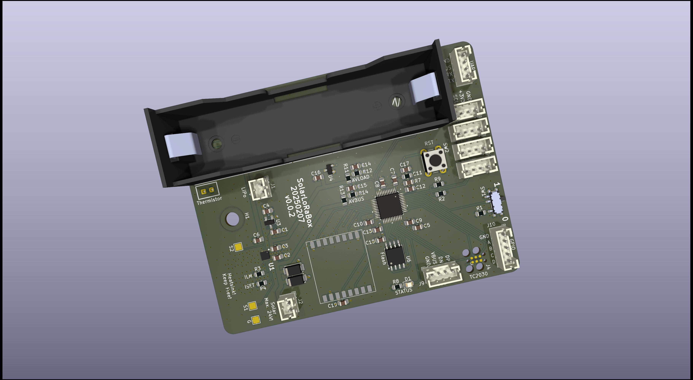

# What is this thing?

This is an experimental platform for an solar driven LoRa sensor station based on the

- Microcontroller: ST STM32U083CCT6
- Radio: Heltec HT-RA62 (Semtech SX1262)
- Charging Controller: TI BQ25185
- Flash: Windbond W25Q128JVS (128 MBit)
- Reset IC: APX803L05-32SA-7 (3.2V)
- LDO: HEERMICR HE9073A30MR (3.0V)

Plan is to´ use it as platform for a wireless sensor based on Zephyr.

# Features

 - Solar Input up to 18V (24V survival)
 - 3A maximum load
 - 1A maximum charge current
 - Pseudo-MPPT (VINDPM)
 - Power Path (= if the battery is fully charged and there's enough solar power the device is getting powered directly from solar. It also can mix battery and solar energy.)
 - Two ADC signals for getting VLOAD and  VBUS voltage using voltage dividers
 - 3.7V LiPo either via 18650 block or JST-PH 2.0 connector

Lots if this stuff was already proven and validated in the project [SolarMeshtasticNode](https://github.com/dm5tt/SolarMeshtasticNode).

# Interfaces

- 4x I2C

- 1x UART

- 1x USB

- 1x GPIO with 4 available pins

# Programming interfaces

The STM32U0 spits out its bootloader on the I2C, UART and USB.

For "comfort programming" it has a TC2030 where you can connect a Segger or ST-Link

# Evaluation

[Verification of PCB v0.0.1](EVALUATION-v001.md)
